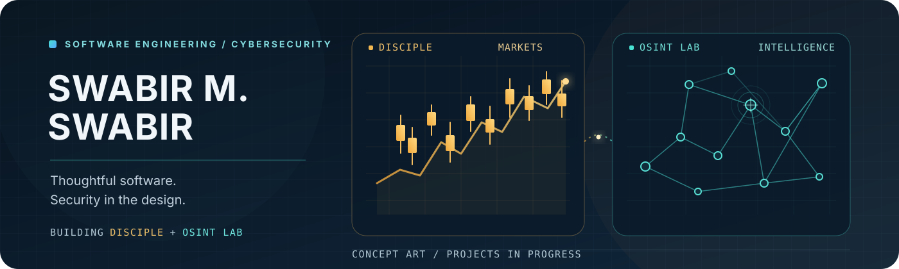

  

  Software engineering student · Cybersecurity certificate holder · Exploring AppSec

---

## What I'm building

### Disciple
A local-first workspace for multi-market analysis, trading journaling, and risk tracking.

### OSINT Lab
An OSINT and digital-forensics workbench with simulated investigations and browser-based tools.

*Both projects are in progress; I’ll add public links when they’re ready to share.*

## Tools I've worked with

`JavaScript` · `HTML/CSS` · `Python` · `C++` · `Kotlin` · `Shell`

## Currently exploring

`Application Security` · `Threat Modeling` · `Secure Development`

---

  <a href="https://www.linkedin.com/in/swabir-mohammed/">Connect on LinkedIn</a>

